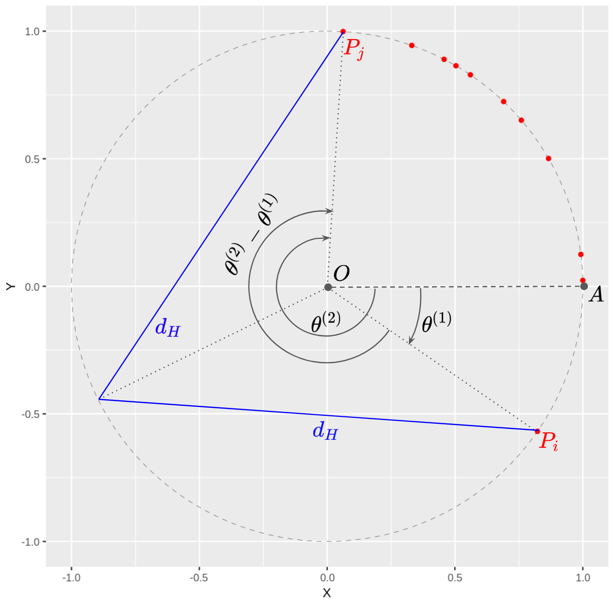

```{r setup, echo = FALSE, eval = TRUE, purl = FALSE}
knitr::opts_chunk$set(echo = FALSE, eval = TRUE,
                      comment = NA, warning = FALSE,
                      message = FALSE)
knitr::opts_chunk$set(fig.width = 8, fig.height = 4,
                      fig.align = "center")
options(scipen=999)
```

```{r}
# imports
library(fitdistrplus)
library(ggforce)
library(ggplot2)
library(kableExtra)
library(latex2exp)
library(patchwork)
library(VGAM)
library(evir)
library(data.table)
library(KernSmooth)
```

```{r}


# reproducibilité
set.seed(15)
```

\newpage

# Données simulées

1.

```{r}


# A1
runitcircle <- function(n = 100) {
  u <- runif(n, min = 0, max = 1)
  return(data.frame(X = cos(2 * pi * u), Y = sin(2 * pi * u)))
}
```

Sur la figure \@ref(fig:unif-unit-circle) nous avons représenté les $N = 100$ points générés uniformément sur le cercle unitaire.

```{r unif-unit-circle, fig.height = 3, fig.cap = "Points uniformément distribués sur le cercle unitaire."}
# plot
ggplot(data = runitcircle()) +
  geom_circle(data = data.frame(linewidth = .1, alpha = .05),
              aes(x0 = 0, y0 = 0, r = 1, linewidth = linewidth),
              linetype = "dashed") +
  geom_point(aes(x = X, y = Y), col = "red") +
  coord_fixed()
```

2.

```{r}

# A2
rcauchy <- function(n = 100, phi = .5) {
  u <- runif(n, min = 0, max = 1)
  x <- cos(2 * pi * u)
  y <- sin(2 * pi * u)
  return(data.frame(
    X = (2 * phi + x + phi^2 * x) / (1 + phi^2 + 2 * phi * x),
    Y = (y - phi^2 * y) / (1 + phi^2 + 2 * phi * x)
  ))
}
```

Nous avons fait varier la valeur de $\varphi$ et comme nous pouvons le constater sur la figure \@ref(fig:cauchy) ce paramètre impacte l'uniformité de la répartition des points sur le cercle unitaire. Nous avons choisi de fixer $\varphi=0.5$ pour la suite du devoir, afin de réaliser un compromis sur l'uniformité de la distribution des variables aléatoires $\epsilon_i$.

```{r cauchy, fig.height = 3, fig.cap = "Points distribués sur le cercle unitaire selon la loi de Cauchy."}
# plot
g_025 <- ggplot(data = rcauchy(phi = .25)) +
  geom_circle(data = data.frame(linewidth = .1, alpha = .05),
              aes(x0 = 0, y0 = 0, r = 1, linewidth = linewidth),
              linetype = "dashed") +
  geom_point(aes(x = X, y = Y), col = "red") +
  labs(caption = TeX("$\\varphi=0.25$")) +
  theme(axis.title.x = element_blank(),
        plot.margin = margin(0, 0, 0, 0, "pt")) +
  coord_fixed()
g_05 <- ggplot(data = rcauchy(phi = .5)) +
  geom_circle(data = data.frame(linewidth = .1, alpha = .05),
              aes(x0 = 0, y0 = 0, r = 1, linewidth = linewidth),
              linetype = "dashed") +
  geom_point(aes(x = X, y = Y), col = "red") +
  labs(caption = TeX("$\\varphi=0.5$")) +
  theme(axis.title.y = element_blank(),
        axis.text.y = element_blank(),
        axis.ticks.y = element_blank(),
        plot.margin = margin(0, 0, 0, 0, "pt")) +
  coord_fixed()
g_075 <- ggplot(data = rcauchy(phi = .75)) +
  geom_circle(data = data.frame(linewidth = .1, alpha = .05),
              aes(x0 = 0, y0 = 0, r = 1, linewidth = linewidth),
              linetype = "dashed") +
  geom_point(aes(x = X, y = Y), col = "red") +
  labs(caption = TeX("$\\varphi=0.75$")) +
  theme(axis.title.x = element_blank(),
        axis.title.y = element_blank(),
        axis.text.y = element_blank(),
        axis.ticks.y = element_blank(),
        plot.margin = margin(0, 0, 0, 0, "pt")) +
  coord_fixed()

g_025 + g_05 + g_075
```

3.

```{r}

# A3
rs <- function(n = 1000) {
  p <- runitcircle(1)
  eps_n <- rcauchy(n)
  s <- p
  for (i in seq_len(nrow(eps_n))) {
    p <- data.frame(
      X = p$X[[1]] * eps_n$X[[i]] - eps_n$Y[[i]] * p$Y[[1]],
      Y = p$X[[1]] * eps_n$Y[[i]] + eps_n$X[[i]] * p$Y[[1]]
    )
    s <- rbind(s, p)
  }
  return(s)
}
Sn_10 <- rs(n = 10)
Sn_50 <- rs(n = 50)
Sn_100 <- rs(n = 100)
Sn_500 <- rs(n = 500)
```

Sur la figure \@ref(fig:sn) nous avons illustré $\mathcal{S}_n$ en faisant varier $n$. Nous pouvons noter que la répartition sur le cercle unitaire semble plutôt uniforme, compte tenu de notre choix de $\varphi$.

```{r sn, fig.height = 6, fig.cap = "Représentation de $\\mathcal{S}_n$ pour différentes valeurs de $n$."}
# plot
g_10 <- ggplot(data = Sn_10) +
  geom_circle(data = data.frame(linewidth = .1, alpha = .05),
              aes(x0 = 0, y0 = 0, r = 1, linewidth = linewidth),
              linetype = "dashed") +
  geom_point(aes(x = X, y = Y), col = "red") +
  labs(caption = TeX("$n=10$")) +
  theme(axis.title.x = element_blank(),
        axis.text.x = element_blank(),
        axis.ticks.x = element_blank(),
        plot.margin = margin(0, 0, 1, 0, "pt")) +
  coord_fixed()
g_50 <- ggplot(Sn_50) +
  geom_circle(data = data.frame(linewidth = .1, alpha = .05),
              aes(x0 = 0, y0 = 0, r = 1, linewidth = linewidth),
              linetype = "dashed") +
  geom_point(aes(x = X, y = Y), col = "red") +
  labs(caption = TeX("$n=50")) +
  theme(axis.title.x = element_blank(),
        axis.text.x = element_blank(),
        axis.ticks.x = element_blank(),
        axis.title.y = element_blank(),
        axis.text.y = element_blank(),
        axis.ticks.y = element_blank(),
        plot.margin = margin(0, 0, 1, 0, "pt")) +
  coord_fixed()
g_100 <- ggplot(Sn_100) +
  geom_circle(data = data.frame(linewidth = .1, alpha = .05),
              aes(x0 = 0, y0 = 0, r = 1, linewidth = linewidth),
              linetype = "dashed") +
  geom_point(aes(x = X, y = Y), col = "red") +
  labs(caption = TeX("$n=100$")) +
  theme(plot.margin = margin(0, 0, 0, 0, "pt")) +
  coord_fixed()
g_500 <- ggplot(Sn_500) +
  geom_circle(data = data.frame(linewidth = .1, alpha = .05),
              aes(x0 = 0, y0 = 0, r = 1, linewidth = linewidth),
              linetype = "dashed") +
  geom_point(aes(x = X, y = Y), col = "red") +
  labs(caption = TeX("$n=500$")) +
  theme(axis.title.y = element_blank(),
        axis.text.y = element_blank(),
        axis.ticks.y = element_blank(),
        plot.margin = margin(0, 0, 0, 0, "pt")) +
  coord_fixed()

(g_10 + g_50) / (g_100 + g_500)
```

4.

La figure \@ref(fig:sn) donne l'impression que $\mathcal{S}_n$ s'approche du cercle unitaire. Sur la figure \@ref(fig:sn-M), nous avons augmenté $n$ ($n=10000$) et il apparait encore plus clairement que $\mathcal{S}_n$ converge bien vers $\mathcal{M}$, le cercle unitaire.

```{r sn-M, fig.height = 3, fig.cap = "Illustration de $\\mathcal{S}_n$ approchant $\\mathcal{M}$, le cercle unitaire."}

# A4
ggplot(data = rs(10000)) +
  geom_circle(data = data.frame(linewidth = .1, alpha = .05),
              aes(x0 = 0, y0 = 0, r = 1, linewidth = linewidth),
              linetype = "dashed") +
  geom_point(aes(x = X, y = Y), col = "red") +
  coord_fixed()
```

# Distance de Hausdorff et bande de confiance

Dans notre cas, l'expression de la distance de Hausdorff peut être simplifiée.

Nous avons vu que $\mathcal{M}$ est déterministe et correspond au cercle unitaire, et que par construction les éléments de $\mathcal{S}_n$ sont situés sur le cercle unitaire. Ainsi $\mathcal{S}_n \subset \mathcal{M}$, et donc :
$$\max_{1 \leq i \leq n} \min_{x \in \mathcal{M}} d(x, X_i) = 0$$
De plus, $\max\limits_{x \in \mathcal{M}} \min\limits_{1 \leq i \leq n} d(x, X_i)$ correspond à la mesure de la corde entre l'isobarycentre de l'arc de cercle formé par les deux éléments de $\mathcal{S}_n$ voisins sur le cercle unitaire les plus éloignés et l'un de ces éléments. Cette distance est représentée sur la figure \@ref(fig:dh-ex). \newline
Plus formellement, en notant :

* $\theta_i = \angle AOP_i$ où $A=(1,0)$ et $O=(0,0)$
* $\mathcal{S}_n^{'} = \{\theta^{(1)}, ..., \theta^{(n)}, \theta^{(n+1)} = 2\pi+\theta^{(1)}\}$

Nous obtenons pour la distance de Hausdorff :

$$
d_H(\mathcal{S}_n, \mathcal{M}) = d_H(\mathcal{S}_n^{'}, \mathcal{M}) = 2\sin\left(\frac{1}{2} \times \frac{\max\limits_{1 \leq i \leq n} \theta^{(i+1)}-\theta^{(i)}}{2}\right)
$$

Nous avons implémenté le calcul de cette distance et c'est celle que nous utilisons dans la suite du devoir.

```{r dh-ex, fig.cap = "Distance de Hausdorff sur le cercle unitaire."}


# B
# image illustrant la distance de Hausdorff sur le cercle unitaire

```

```{r}

# tri de Sn le long du cercle unitaire
sort_unit_circle <- function(s) {
  s$theta <- atan2(s$Y, s$X)
  # theta dans [0,2pi]
  theta_neg <- which(s$theta < 0)
  s$theta[theta_neg] <- 2 * pi + s$theta[theta_neg]
  return(s[order(s$theta), ])
}

# implémentation de la distance de Hausdorff dans notre cas précis
dist_hausdorff_unit_circle <- function(s) {
  # tri de s
  s <- sort_unit_circle(s)
  s <- rbind(s, 2 * pi + s[1, ]) # fermeture du cercle

  # calcul des distances angulaires entre voisins
  s$theta.d <- c(sapply(1:(nrow(s) - 1), function(i) {
    s$theta[[i + 1]] - s$theta[[i]]
  }), 0)

  # distance sur le cercle unitaire
  # return(max(s$theta.d)/2)

  # distance dans le plan - mesure de la corde
  return(2*sin(max(s$theta.d)/4))
}
```

\newpage

1.

```{r}

# B1
n <- as.integer(c(1e1, 1e2, 1e3, 1e4))
dh <- sapply(n, function (ni) dist_hausdorff_unit_circle(rs(ni)))
```

Comme nous pouvions nous y attendre, la table \@ref(tab:dh-n) permet de constater que la distance de Hausdorff décroit lorsque la taille de l'ensemble $\mathcal{S}_n$ augmente.

```{r dh-n}
# table
kable(t(dh), col.names = paste0("n=", n), digits = 4,
      caption = "$d_H(\\mathcal{S}_n, \\mathcal{M})$ en fonction de $n$",
      label="dh-n") %>%
  kable_styling(latex_options = "HOLD_position")
```

2.

```{r}

# B2
n <- unique(c(seq(1e1, 1e2, length.out = 10),
              seq(1e2, 1e3, length.out = 10),
              seq(1e3, 5e3, length.out = 10)))
dhn <- sapply(n, function (ni) dist_hausdorff_unit_circle(rs(ni)))
```

Nous pouvons nous interroger sur la vitesse à laquelle l'ensemble $\mathcal{S}_n$ s'approche de l'ensemble $\mathcal{M}$ et donc sur le comportement asymptotique de $d_H(\mathcal{S}_n, \mathcal{M})$. La figure \@ref(fig:dh-vn) permet de comparer la vitesse de convergence empirique avec plusieurs fonctions dépendantes de $n$. S'il semble clair que la vitesse de convergence est plus rapide que $\sqrt{\log(n)/n}$, il est difficile sur cette figure de privilégier une vitesse en $1/\sqrt{n}$ ou en $1/n$. \newline
Le problème auquel nous nous intéressons a été adressé il y a plusieurs dizaines d'années \cite{lh} et d'après les résultats montrés par l'auteur de l'article, la vitesse de convergence devrait être en $\log(n)/n$. Nous avons donc fait figurer la fonction correspondant à celle-ci sur le graphique, et il apparait que la vitesse empirique en est également proche.

```{r dh-vn, fig.height = 6, fig.cap = "Vitesse de convergence de $\\mathcal{S}_n$ vers $\\mathcal{M}$."}
# plot
curves_label <- c("dh" = "$d_H(S_n, M)$", "log-inv" = "$\\frac{\\log(n)}{n}$",
                  "inv" = "$\\frac{1}{n}$", "inv-sqrt" = "$\\frac{1}{\\sqrt{n}}$",
                  "sqrt-log-inv" = "$\\sqrt{\\frac{\\log(n)}{n}}$")
g <- ggplot(data = data.frame(n = n, dh = dhn)) +
  geom_point(aes(x = n, y = dh, color = "dh"), size = 1, show.legend = FALSE) +
  geom_function(fun = function (x) log(x)/x, aes(color = "log-inv"),
                xlim = c(n[[1]], n[[length(n)]]),
                linetype = "dashed") +
  geom_function(fun = function (x) 1/x, aes(color = "inv"),
                xlim = c(n[[1]], n[[length(n)]]),
                linetype = "dashed") +
  geom_function(fun = function (x) 1/sqrt(x), aes(color = "inv-sqrt"),
                xlim = c(n[[1]], n[[length(n)]]),
                linetype = "dashed") +
  geom_function(fun = function (x) sqrt(log(x)/x), aes(color = "sqrt-log-inv"),
                xlim = c(n[[1]], n[[length(n)]]),
                linetype = "dashed") +
  scale_color_discrete(labels = function (b) TeX(curves_label[b])) +
  labs(y = TeX("$d_H(S_n, M)$"), color = "Courbe")

layout <- "
AAA
AAA
BBB
"
(g / (g + xlim(c(1000, 5000)) + ylim(c(0, .1)))) +
  plot_layout(design = layout, guides = "collect")
```

Afin de mieux évaluer graphiquement la vitesse de convergence, nous avons réprésenté sur la figure \@ref(fig:vn) l'évolution de $d_H(\mathcal{S}_n, \mathcal{M})n/\log(n)$, $d_H(\mathcal{S}_n, \mathcal{M})n$ et $d_H(\mathcal{S}_n, \mathcal{M})\sqrt{n}$ en fonction de $n$. Cette fois-ci, il apparaît plus clairement que la vitesse de convergence est de l'ordre de $\log(n)/n$ ou $1/n$, ce qui rejoint les résultats établis dans l'article \cite{lh}.

```{r vn, fig.height = 6, fig.cap = "Vitesse de convergence de $\\mathcal{S}_n$ vers $\\mathcal{M}$."}
# plot
g_log_inv <- ggplot(data = data.frame(n = n, dh = dhn)) +
  geom_point(aes(x = n, y = dh * n / log(n)), size = 1) +
  labs(y = TeX("$\\frac{d_H(S_n, M)n}{\\log(n)}$")) +
  xlim(c(1000, 5000)) + ylim(c(3, 4.5)) +
  theme(axis.title.x = element_blank(),
        axis.text.x = element_blank(),
        axis.ticks.x = element_blank(),
        plot.margin = margin(0, 0, 1, 0, "pt"))
g_inv <- ggplot(data = data.frame(n = n, dh = dhn)) +
  geom_point(aes(x = n, y = dh * n), size = 1) +
  labs(y = TeX("$d_H(S_n, M)n$")) +
  xlim(c(1000, 5000)) + ylim(c(23.5, 35)) +
  theme(axis.title.x = element_blank(),
        axis.text.x = element_blank(),
        axis.ticks.x = element_blank(),
        plot.margin = margin(0, 0, 1, 0, "pt"))
g_inv_sqrt <- ggplot(data = data.frame(n = n, dh = dhn)) +
  geom_point(aes(x = n, y = dh * sqrt(n)), size = 1) +
  labs(y = TeX("$d_H(S_n, M)\\sqrt{n}$")) +
  xlim(c(1000, 5000)) + ylim(c(.4, .9))

g_log_inv / g_inv / g_inv_sqrt
```

Ici encore, les résultats obtenus dépendent du choix de $\varphi$. Plus $\varphi$ est faible, plus la répartition sur le cercle unitaire de $\mathcal{S}_n$ sera uniforme et donc plus la vitesse à laquelle $\mathcal{S}_n$ s'approche de $\mathcal{M}$ sera élevée.

3.

```{r, eval = F}

# B3
dh_5e3 <- replicate(500, dist_hausdorff_unit_circle(rs(5e3))) # long
saveRDS(dh_5e3, "dh_5e3") # pour ne pas le faire à chaque compilation
```

```{r}
dh_5e3 <- readRDS("dh_5e3") # on lit celui déjà enregistré
fit_dh_fr <- fitdist(dh_5e3, "frechet",
                     start = list(scale = 1/sqrt(5000), shape = 8),
                     fix.arg = list(location = 0))
fit_dh_gb <- gumbel(dh_5e3, method = "BFGS", control = list(maxit = 500))
fit_dh_wb <- fitdist(dh_5e3, "weibull")
fit_dh <- data.frame(llh = c(fit_dh_fr$loglik, -fit_dh_gb$nllh.final, fit_dh_wb$loglik),
                     scale = c(fit_dh_fr$estimate[["scale"]],
                               fit_dh_gb$par.ests[["sigma"]],
                               fit_dh_wb$estimate[["scale"]]),
                     location = c(0, fit_dh_gb$par.ests[["mu"]], NA),
                     shape = c(fit_dh_fr$estimate[["shape"]], NA,
                               fit_dh_wb$estimate[["shape"]]),
                     row.names = c("Fréchet", "Gumbel", "Weibull"))
```

A première vue, l'histogramme des valeurs prisent par $d_H(\mathcal{S}_n, \mathcal{M})$ pour $n=5000$ figurant sur la figure \@ref(fig:dh-hist) nous a laissé penser que la loi asymptotique de $d_H(\mathcal{S}_n, \mathcal{M})$ pouvait être une loi de Weibull ou une loi Gamma. Cependant, dans l'article \cite{lh} que nous avons précédemment mentionné, l'auteur montre que la convergence asymptotique en loi suit une distribution de Gumbel. \newline
Nous avons utilisé les packages **evir** et **fitdistrplus** pour estimer les paramètres par maximum de vraisemblance des lois de Fréchet, Gumbel et Weibull, communément utilisées pour modéliser des phénomènes de valeurs extrêmes (comme la distance maximum). La table \@ref(tab:dh-fit) et la figure \@ref(fig:dh-hist) permettent de comparer les résultats obtenus et de constater que les lois de Fréchet et Gumbel donnent des résultats très similaires, mais sur la base de la log-vraisemblance, Gumbel semble bien la plus adaptée.

```{r dh-fit}
# table
col.names <- colnames(fit_dh)
col.names[[1]] <- "Log-vraisemblance"
kable(fit_dh, digits = 6, col.names = col.names,
      caption = "Log-vraisemblance et paramètres ajustés pour la loi asymptotique de $d_H(\\mathcal{S}_n, \\mathcal{M})$",
      label="dh-fit") %>%
  kable_styling(latex_options = "HOLD_position")
```

```{r dh-hist, fig.cap = "Histogramme des valeurs prisent par $d_H(\\mathcal{S}_n, \\mathcal{M})$ pour $n=5000$ et densités des loi de Fréchet, Gumbel et Weibull."}
# plot
curves_label <- c("frechet" = "Fréchet", "gumbel" = "Gumbel",
                  "weibull" = "Weibull")
ggplot(data = data.frame(dh = dh_5e3)) +
        geom_histogram(aes(x = dh, y = ..density..), fill = "grey") +
        geom_function(fun = function (x) dfrechet(x,
                                                  scale = fit_dh$scale[[1]],
                                                  location = fit_dh$location[[1]],
                                                  shape = fit_dh$shape[[1]]),
                      aes(color = "frechet")) +
        geom_function(fun = function (x) dgumbel(x,
                                                 scale = fit_dh$scale[[2]],
                                                 location = fit_dh$location[[2]]),
                      aes(color = "gumbel")) +
        geom_function(fun = function (x) dweibull(x,
                                                  scale = fit_dh$scale[[3]],
                                                  shape = fit_dh$shape[[3]]),
                      aes(color = "weibull")) +
        scale_color_discrete(labels = function (b) curves_label[b]) +
        labs(x = "x", y = "densité", color = "Loi")
```

# Données bruitées

Dans cette section, nous examinons données bruitées, données par
$$ X_i + \sigma \alpha_i, i = 1, \ldots, n .$$
Les $\alpha_i$ sont i.i.d. et suivent une loi normale standard 2-dimensionelle. Nous choisissons $\sigma = 0.2$.

```{r}


# C1
sig <- .2

add_bruit <- function(pts, sig){
  n <- nrow(pts)

  pts_bruit <- copy(pts)
  pts_bruit$X <- pts_bruit$X + rnorm(n, mean = 0, sd = sig)
  pts_bruit$Y <- pts_bruit$Y + rnorm(n, mean = 0, sd = sig)

  return(pts_bruit)
}

Sn_10_b <- add_bruit(Sn_10, sig)
Sn_50_b <- add_bruit(Sn_50, sig)
Sn_100_b <- add_bruit(Sn_100, sig)
Sn_500_b <- add_bruit(Sn_500, sig)
```

1.

Sur la figure \@ref(fig:donnees-bruitees) nous avons représenté les nuages des points $(X_i)$ obtenus à partir des points $(P_i)$ simulés question A3.

```{r donnees-bruitees, fig.height = 6, fig.cap = "Données bruitées pour différentes valeurs de $n$."}

# plot
g_10 <- ggplot(data = Sn_10_b) +
  geom_circle(data = data.frame(linewidth = .1, alpha = .05),
              aes(x0 = 0, y0 = 0, r = 1, linewidth = linewidth),
              linetype = "dashed") +
  geom_point(aes(x = X, y = Y), col = "red") +
  labs(caption = TeX("$n=10$")) +
  theme(axis.title.x = element_blank(),
        axis.text.x = element_blank(),
        axis.ticks.x = element_blank(),
        plot.margin = margin(0, 0, 1, 0, "pt")) +
  xlim(c(-1.3,1.3)) +
  ylim(c(-1.3,1.3)) +
  coord_fixed()
g_50 <- ggplot(Sn_50_b) +
  geom_circle(data = data.frame(linewidth = .1, alpha = .05),
              aes(x0 = 0, y0 = 0, r = 1, linewidth = linewidth),
              linetype = "dashed") +
  geom_point(aes(x = X, y = Y), col = "red") +
  labs(caption = TeX("$n=50")) +
  theme(axis.title.x = element_blank(),
        axis.text.x = element_blank(),
        axis.ticks.x = element_blank(),
        axis.title.y = element_blank(),
        axis.text.y = element_blank(),
        axis.ticks.y = element_blank(),
        plot.margin = margin(0, 0, 1, 0, "pt")) +
  xlim(c(-1.3,1.3)) +
  ylim(c(-1.3,1.3)) +
  coord_fixed()
g_100 <- ggplot(Sn_100_b) +
  geom_circle(data = data.frame(linewidth = .1, alpha = .05),
              aes(x0 = 0, y0 = 0, r = 1, linewidth = linewidth),
              linetype = "dashed") +
  geom_point(aes(x = X, y = Y), col = "red") +
  labs(caption = TeX("$n=100$")) +
  theme(plot.margin = margin(0, 0, 0, 0, "pt")) +
  xlim(c(-1.3,1.3)) +
  ylim(c(-1.3,1.3)) +
  coord_fixed()
g_500 <- ggplot(Sn_500_b) +
  geom_circle(data = data.frame(linewidth = .1, alpha = .05),
              aes(x0 = 0, y0 = 0, r = 1, linewidth = linewidth),
              linetype = "dashed") +
  geom_point(aes(x = X, y = Y), col = "red") +
  labs(caption = TeX("$n=500$")) +
  theme(axis.title.y = element_blank(),
        axis.text.y = element_blank(),
        axis.ticks.y = element_blank(),
        plot.margin = margin(0, 0, 0, 0, "pt")) +
  xlim(c(-1.3,1.3)) +
  ylim(c(-1.3,1.3)) +
  coord_fixed()

(g_10 + g_50) / (g_100 + g_500)
```

# Lien avec la régression non paramétrique

Nous notons les cordonnées de $X_i = (X_i^1,Y_i)$ et posons
$$ Y_i = r(X_i^1) + e_i, $$
où $(e_i)$ est une suite d’erreurs centrées à valeurs réelles qu’on modélisera par une loi normale centrée.

1.

Nous avons tout d'abord ajusté l'estimateur à noyau pour les $n=100$ données bruitées présentées ci-dessus en utilisant le noyau gaussien. Cela à une approximation par polynômes locaux de degré $0$, nous pouvons donc utiliser la méthode *locpoly* de la librarie **KernSmooth**. Sur la figure \@ref(fig:est-noyau) nous avons représenté l'estimateur à noyau en faisant varier les valeurs prisent par la fenêtre $h$.

```{r}

# D1
H <- c(.01, 0.05, 0.1, 0.2)

r_hat_100 <- lapply(H, function (h) {
  r_hat_xy <- locpoly(Sn_100_b$X, Sn_100_b$Y, bandwidth = h,
                      degree = 0, gridsize = 1000)
  return(data.frame(X = r_hat_xy$x, Y = r_hat_xy$y))
})
```

```{r est-noyau, fig.cap = "Estimateur à noyau pour $n=100$ et différentes valeurs de $h$."}

# plot
g_h01 <- ggplot(data = r_hat_100[[1]]) +
  geom_line(aes(x = X, y = Y), col = "red") +
  labs(caption = TeX("$n=100,\ h=0.01$")) +
  theme(axis.title.x = element_blank(),
        axis.text.x = element_blank(),
        axis.ticks.x = element_blank(),
        plot.margin = margin(0, 0, 1, 0, "pt")) +
  xlim(c(-1.5, 1.5)) + ylim(c(-1.1, 1.1))
g_h05 <- ggplot(data = r_hat_100[[2]]) +
  geom_line(aes(x = X, y = Y), col = "red") +
  labs(caption = TeX("$n=100,\ h=0.05")) +
  theme(axis.title.x = element_blank(),
        axis.text.x = element_blank(),
        axis.ticks.x = element_blank(),
        axis.title.y = element_blank(),
        axis.text.y = element_blank(),
        axis.ticks.y = element_blank(),
        plot.margin = margin(0, 0, 1, 0, "pt")) +
  xlim(c(-1.5, 1.5)) + ylim(c(-1.1, 1.1))
g_h1 <- ggplot(data = r_hat_100[[3]]) +
  geom_line(aes(x = X, y = Y), col = "red") +
  labs(caption = TeX("$n=100,\ h=0.1$")) +
  theme(plot.margin = margin(0, 0, 0, 0, "pt")) +
  xlim(c(-1.5, 1.5)) + ylim(c(-1.1, 1.1))
g_h2 <- ggplot(data = r_hat_100[[4]]) +
  geom_line(aes(x = X, y = Y), col = "red") +
  labs(caption = TeX("$n=100,\ h=0.2$")) +
  theme(axis.title.y = element_blank(),
        axis.text.y = element_blank(),
        axis.ticks.y = element_blank(),
        plot.margin = margin(0, 0, 0, 0, "pt")) +
  xlim(c(-1.5, 1.5)) + ylim(c(-1.1, 1.1))

(g_h01 + g_h05) / (g_h1 + g_h2)
```

2.

La fonction $\hat{r}$ ne ressemble évidemment pas au nuage de points. Pour de plus grandes valeurs de $h$, elle est proche d'être égale à $0$ quelque soit $X_i^1$, bien que $Y_i$ soit proche de $0$ uniquement lorsque $X_i^1$ est proche de $1$. Le problème réside dans le modèle : les points $(X_i)$ se trouvent sur le cercle unitaire $\mathcal{M}$, donc le lien entre les coordonnées n'est pas donné par une relation fonctionnelle. Notre modélisation n'est donc pas adaptée. La relation liant $X_i^1$ et $Y_i$ est plutôt de forme
$$ Y_i = \pm r(X_i^1) + e_i, \qquad r(x) = \sqrt{1-x^2 } $$
Nous essayons d'estimer $\pm r$ par une seul fonction $\hat{r}$, le résultat ne peut donc pas être bon. Dans notre cas, pour $h$ grand, $\hat{r}$ est proche de $\frac{1}{2}(+r + (-r)) = 0$.

Cependant, la régression que nous faisons permet de représenter la régularité de la répartition des points de $\mathcal{S}_n$ sur $\mathcal{M}$. Pour illustrer cela nous avons repris la représentation de la régression faite pour $n=100$ points et $h=0.1$ à la question précédente à laquelle nous avons ajouté les histogrammes des $(X_i^1)$ pour $Y_i \leq 0$ et $Y_i \geq 0$. Et nous avons fait de même en prenant cette fois-ci $n=10000$ points uniformément répartis sur $\mathcal{M}$, comme dans la question A1. \newline
Nous pouvons donc voir sur la figure \@ref(fig:est-reg) que la régression correspond bien à une estimation de la densité relative à l'axe des abscisses. Ainsi, nous pouvons voir sur la partie gauche de la figure qu'avec $100$ points de $\mathcal{S}_n$ bruités la régularité le long du cercle est nettement moins forte que sur la partie droite pour $10000$ points générés uniformément sur $\mathcal{M}$ et sans bruit.

```{r}

# D2
xy_unitcircle <- runitcircle(10000)
r_hat_unitcircle <- locpoly(xy_unitcircle$X, xy_unitcircle$Y, bandwidth = 0.1,
                    degree = 0, gridsize = 1000)
r_hat_unitcircle <- data.frame(X = r_hat_unitcircle$x, Y = r_hat_unitcircle$y)
```

```{r est-reg, fig.cap = "Estimateur non paramétrique et répartition des points sur le cercle unitaire."}

# plot
g_h1 <- ggplot() +
  geom_histogram(data = Sn_100_b[Sn_100_b$Y >= 0, ],
                 aes(x = X, y = ..density..), fill = "grey") +
  geom_histogram(data = Sn_100_b[Sn_100_b$Y <= 0, ],
                 aes(x = X, y = -..density..), fill = "grey") +
  geom_line(data = r_hat_100[[3]],
            aes(x = X, y = Y), col = "red") +
  labs(y = "Y", caption = TeX("$n=100,\ h=0.1$")) +
  xlim(c(-1.5, 1.5)) + ylim(c(-1, 1))

g_uc <- ggplot() +
  geom_histogram(data = xy_unitcircle[xy_unitcircle$Y >= 0, ],
                 aes(x = X, y = ..density..), fill = "grey") +
  geom_histogram(data = xy_unitcircle[xy_unitcircle$Y <= 0, ],
                 aes(x = X, y = -..density..), fill = "grey") +
  geom_line(data = r_hat_unitcircle,
            aes(x = X, y = Y), col = "red") +
  labs(caption = TeX("$n=10000,\ h=0.01$")) +
  theme(axis.title.y = element_blank(),
        axis.text.y = element_blank(),
        axis.ticks.y = element_blank()) +
  xlim(c(-1.5, 1.5)) + ylim(c(-1, 1))

g_h1 + g_uc
```

\newpage

\printbibliography[label=references, title={Références}]
\let\printbibliography\relax
\addcontentsline{toc}{section}{Références}

\newpage

# Code {.unnumbered}

```{r get-labels, results = T}
labs <- knitr::all_labels()
labs <- setdiff(labs, c("setup", "get-labels"))
```
```{r ref.label = labs, eval = F, echo = T}
```
